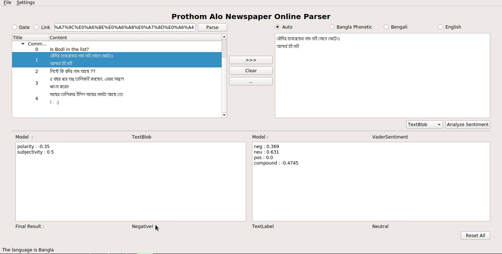
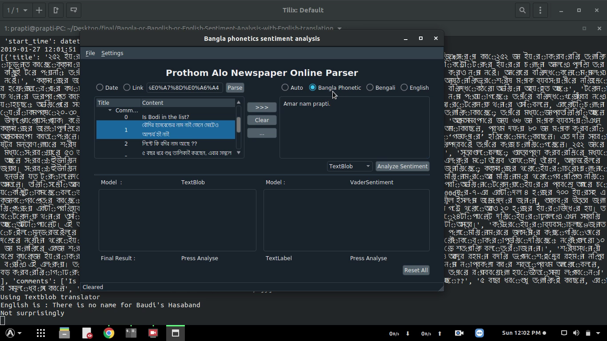

# Bangla or Banglish Sentiment Analysis with English Translation
> Primary version

 

## Description
A Sentiment analysis with a graphical user interface of bangla or phonetic Bangla (Banglish) language project. This uses a rule-based sentiment analysis API of [TextBlob](https://textblob.readthedocs.io/en/dev/) and [VaderSentiment](https://github.com/cjhutto/vaderSentiment).

## Motivation
This is my third semester System Development project. I was trying to improve my skills with [PyQt](https://wiki.python.org/moin/PyQt) and the use of Python APIs.

## Python Package Dependencies
1. Scrapy
2. QDarkstyle
3. PyQt
4. Vadersentiment
5. TextBlob

N.B. Geckodriver must be installed in your system for website automation.

## Getting started
1. `git clone --recursive https://github.com/nurul-ismat/Bangla-or-Banglish-or-English-Sentiment-Analysis-with-English-translation.git`
2. Install the required dependencies in your Python virtual environment.
3. `python3 main.py`

That's it! As the project is just for learning purposes, please look into how the project is structured and how the control of the project flows.

## Features
What are all the bells and whistles this project can perform?
* Scrape the title and content of the webpage of Prothom Alo.
* Scrape all the comments from that webpage of Prothom Alo.
* Scrape the above two from all the webpages of prothom alo date of a specific date.
* Translate the content from phonetic Bangla (Banglish) to Bangla and from Bangla to English.
* Display results of two sentiment analysis APIs(TextBlob and VaderSentiment).

## Usage
1. Run main.py
2. Provide a link to a post from [Prothom Alo](https://www.prothomalo.com/) or a date in the first text field.
3. Select the appropriate data provided in the text field (Link or Date).
4. Click Parse. This will parse the title, content, and comments on that page.
5. Select some items of the parsed list.
6. Select the appropriate translation api to use from the drop-down and the appropriate use of radio button for the source language.
7. Click on the Analyze button. This will analyse the contents selected and show the results.

N.B. You can also use your own text in the input text field for sentiment analysis.

## Contributing
The main reason to publish something open source is that anyone can just jump in and start contributing to my project.
So if you'd like to contribute, please fork the repository and use a feature branch. Pull requests are warmly welcome.

## Links and References
- Project homepage: https://github.com/nurul-ismat/Bangla-or-Banglish-or-English-Sentiment-Analysis-with-English-translation
- Repository: https://github.com/nurul-ismat/Bangla-or-Banglish-or-English-Sentiment-Analysis-with-English-translation.git
- Issue tracker: https://github.com/nurul-ismat/Bangla-or-Banglish-or-English-Sentiment-Analysis-with-English-translation/issues
<<<<<<< HEAD

## Author
Nurul Ismat Tanni
Bangladesh
=======
- In case of any help from me, please contact ismattanni@gmail.com directly without any hesitation! I will be glad to help you.

## Author
Nurul Ismat Tanni
ismattanni@gmail.com  

